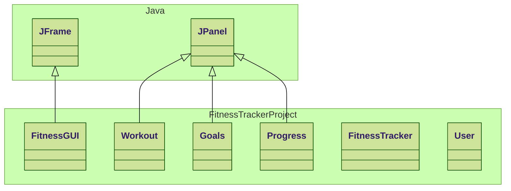

# FitnessTracker
Classes Done:
- User Class.

Classes Work in Progress:
- None.

## Class Diagram

```mermaid
%%{init: {'theme':'forest'}}%%
classDiagram
    JFrame <|-- FitnessGUI
    JPanel <|-- Workout 
    JPanel <|-- Goals
    JPanel <|-- Progress

    namespace Java {
        class JFrame {

        }
        class JPanel {

        }
    }
    namespace FitnessTrackerProject {
        class FitnessGUI {
        }
        class FitnessTracker {
        }
        class Goals {

        }
        class Progress {

        }
        class Workout {
        }
        class User {
        }
    }
```
